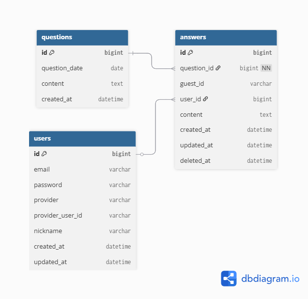

# Daily Q&A DB 초안

## 개요
- API에서 필요한 데이터를 기준으로 DB 구조를 먼저 정리한다.
- 초기 버전에서는 질문 조회와 답변 작성/조회/수정/삭제 기능을 우선 구현한다.
- 로그인 기능은 아직 도입하지 않지만, 비로그인 사용자를 구분하기 위해 `guest_id`를 사용한다.
- 추후 일반 로그인 및 소셜 로그인을 추가할 수 있도록 `users` 테이블 확장을 고려한다.

## 설계 방향
- 질문은 날짜마다 1개씩 제공되므로 질문 테이블에서 날짜를 기준으로 관리한다.
- 답변은 질문과 연결되며, 삭제 시 실제로 제거하지 않고 `deleted_at` 컬럼으로 소프트 삭제 처리한다.
- 휴지통은 별도 테이블을 두지 않고, `answers` 테이블에서 `deleted_at` 값으로 관리한다.
- 휴지통의 남은 보관 일수는 DB에 저장하지 않고 서버에서 계산한다.
- 첨부파일 기능은 추후 확장 기능으로 두고, 현재 MVP에서는 텍스트 답변 중심으로 설계한다.

## 테이블 구성

### 1. questions
- 설명: 날짜별 질문을 저장하는 테이블

| 컬럼명 | 타입 | 설명 |
|---|---|---|
| id | BIGINT | 질문 PK |
| question_date | DATE | 질문이 배정된 날짜 |
| content | TEXT | 질문 내용 |
| created_at | DATETIME | 질문 생성 시각 |

#### 제약조건
- `id`는 기본 키이다.
- `question_date`는 날짜별 질문이 1개만 존재해야 하므로 `UNIQUE` 제약조건을 둔다.
- 질문은 조회만 가능하고 수정 및 삭제는 지원하지 않는다.

### 2. answers
- 설명: 사용자가 작성한 답변을 저장하는 테이블

| 컬럼명 | 타입 | 설명 |
|---|---|---|
| id | BIGINT | 답변 PK |
| question_id | BIGINT | 질문 FK |
| guest_id | VARCHAR | 비로그인 사용자를 식별하는 값 |
| user_id | BIGINT | 로그인 사용자 FK, 초기에는 NULL 허용 |
| content | TEXT | 답변 내용 |
| created_at | DATETIME | 답변 작성 시각 |
| updated_at | DATETIME | 답변 수정 시각 |
| deleted_at | DATETIME | 답변 삭제 시각, 삭제되지 않은 경우 NULL |

#### 제약조건
- `id`는 기본 키이다.
- `question_id`는 `questions.id`를 참조하는 외래 키이다.
- 초기 버전에서는 로그인 기능이 없으므로 `guest_id`를 기준으로 사용자를 구분한다.
- 추후 로그인 기능이 추가되면 `user_id`를 기준으로 사용자 데이터를 연결할 수 있다.
- 일반 답변 조회에서는 `deleted_at IS NULL` 조건을 사용한다.
- 휴지통 조회에서는 `deleted_at IS NOT NULL` 조건을 사용한다.

#### 설계 메모
- `guest_id`는 브라우저 또는 기기 단위의 익명 식별자로 사용한다.
- 사용자가 로그인하면, 동일한 `guest_id`로 작성한 기존 답변을 해당 `user_id`에 연결하는 방식으로 통합할 수 있다.
- 답변 수정 가능 여부는 DB 제약조건보다는 서비스 로직에서 `created_at`과 현재 날짜를 비교해 처리한다.

### 3. users
- 설명: 추후 일반 로그인 및 소셜 로그인 도입 시 사용할 사용자 테이블
- 현재 MVP에서는 바로 구현하지 않아도 되지만, 확장 방향을 고려해 초안을 남겨둔다.

| 컬럼명 | 타입 | 설명 |
|---|---|---|
| id | BIGINT | 사용자 PK |
| email | VARCHAR | 일반 로그인용 이메일 |
| password | VARCHAR | 일반 로그인용 비밀번호 해시 |
| provider | VARCHAR | 소셜 로그인 제공자 정보 |
| provider_user_id | VARCHAR | 소셜 로그인 제공자 내 사용자 식별값 |
| nickname | VARCHAR | 사용자 닉네임 |
| created_at | DATETIME | 계정 생성 시각 |
| updated_at | DATETIME | 계정 수정 시각 |

#### 설계 메모
- 일반 로그인 사용자는 `email`, `password`를 사용한다.
- 소셜 로그인 사용자는 `provider`, `provider_user_id` 조합으로 식별할 수 있다.
- 초기 단계에서는 `answers.user_id`를 NULL 허용으로 두고, 로그인 기능 도입 후 연결한다.

## 테이블 관계
- `questions` 1 : N `answers`
- `users` 1 : N `answers`
- `answers.question_id`는 필수값이므로, 모든 답변은 반드시 하나의 질문과 연결되어야 한다.
- `answers.user_id`는 선택값이므로, 로그인 전에는 NULL을 허용하고 `guest_id`로 사용자를 구분한다.

## ERD
- 현재 ERD는 `questions`, `answers`, `users` 3개 테이블의 관계를 기준으로 정리했다.
- 질문과 답변은 필수 관계로 연결되고, 사용자와 답변은 추후 로그인 확장을 고려한 선택 관계로 연결된다.
- ERD 이미지는 `docs/images/erd.png` 파일로 관리한다.

## 휴지통 처리 방식
- 별도의 `trash` 테이블은 두지 않는다.
- 답변 삭제 시 `answers.deleted_at`에 삭제 시각을 기록한다.
- 휴지통 목록은 `deleted_at`이 있는 답변만 조회해서 보여준다.
- 복원 시에는 `deleted_at` 값을 다시 NULL로 변경한다.
- 30일 보관 여부와 남은 일수는 서버에서 계산한다.

## 추후 확장 가능 항목
- 첨부파일 기능 추가 시 `answer_attachments` 테이블 분리
- 사용자별 하루 1답변 제한 규칙 추가
- 휴지통 자동 영구 삭제 배치 처리
- 로그인 사용자와 guest 데이터 통합 로직 추가
